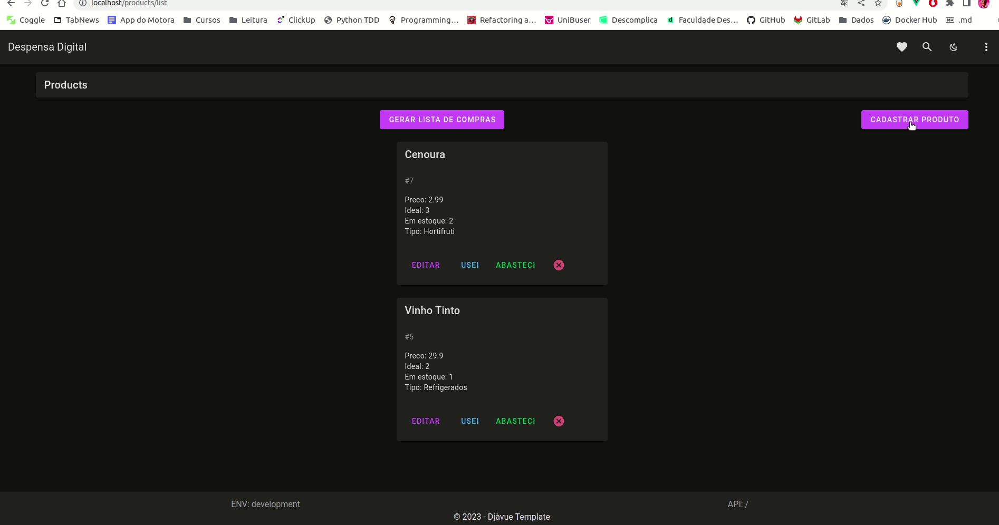

# Despensa Digital

[Vídeo](https://www.youtube.com/watch?v=InxqQUSpFvE&ab_channel=GabrielSantos) de apresentação.

### O que é ?
A Despensa Digital é uma aplicação web que se apoia no template Djavue, e portanto tem backend em **Django** e frontend em **Vue 3** que tem a missão de resolver uma dor que eu tenho no meu cotidiano: facilitar fazer a lista de compras da minha casa!
Isso porque a minha memória não é das melhores e frequentemente eu esqueço de comprar o que acabou no início do mês, porque preciso notar a ausência. Dado essa situação pensei em criar uma aplicação web que resolva meu problema da seguinte forma:
1. Faço o cadastro dos produtos que uso na minha casa, informando quanto tenho de cada um e quanto quero ter em estoque.
2. Idealmente atualizo com frequência ao longo do mês informando ao app que consumi aquele produto. (Mas na verdade eu costumo atualizar antes de sair para fazer as compras hehe).
    Ex.: Registro macarrão e informo que quero ter 2 unidades dele em estoque e tenho 2 atualmente. Ao consumir clico no botão e ele reduz uma unidade para mim.
3. Antes de sair para o mercado fazer as compras, clico em "Gerar lista de compras" e a aplicação gera uma lista com todos os itens que estão abaixo da reserva mensal desejada.
4. A partir disso, vou fazer minhas compras tendo a certeza de que tudo que precisa ser lembrado está lá e que vou comprar apenas o que falta!

### 4 Devs

Quer rodar esse projeto localmente ? Vou deixar os passos aqui para fazer o setup de forma tranquila e sem maiores problemas.
Para isso, é necessário que você clone este projeto e entre na pasta dele pelo seu editor de código. Essa parte eu vou deixar **contigo**!

1. Copie o arquivo `.env-sample` com o comando: `cp .env-sample .env`.
2. Rode o comando `docker compose up` e pronto.

A aplicação estará disponível na sua máquina da seguinte forma:
- Frontend rodando em `locahost:3000`, mas você pode chegar nele apenas acessando o `localhost` no seu navegador
- Backend rodando em `localhost:8000`. Entrando nessa rota, é possível começar a ver os endpoints disponíveis no projeto;
    - Já te adianto que o que é referente aos produtos está em `localhost:8000/api/products`, beleza ?

Caso queira rodar com `APIMOCK` (backendless) rode o seguinte comando:
- `docker compose -f docker-compose.yml -f docker-compose.apimock.yml up frontend`

#### Créditos

- Template Original [Djavue](https://github.com/evolutio/djavue): [Tony Lâmpada](https://github.com/tonylampada)
- Template [Djavue3](https://github.com/huogerac/djavue): [Roger Camargo](https://github.com/huogerac)
- Despensa Digital: [Gabriel Santos](https://github.com/Gabriels999)